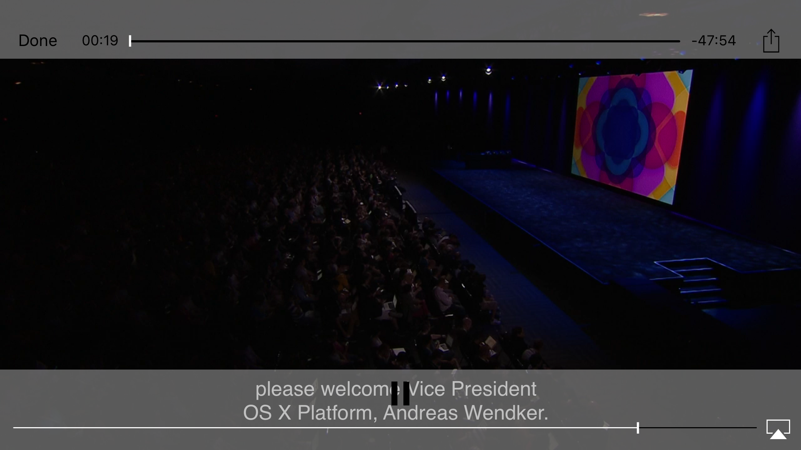

# CMPlayerViewController


[](https://travis-ci.org/Célian Moutafis/CMPlayerViewController)
[](http://cocoapods.org/pods/CMPlayerViewController)
[](http://cocoapods.org/pods/CMPlayerViewController)
[](http://cocoapods.org/pods/CMPlayerViewController)

## Usage

To run the example project, clone the repo, and run `pod install` from the Example directory first.

## Requirements

## Installation



CMPlayerViewController is available through [CocoaPods](http://cocoapods.org). To install
it, simply add the following line to your Podfile:

```ruby
pod "CMPlayerViewController"
```

## Usage ##

To instanciate the ViewController


```swift
	let playerViewController = CMPlayerViewController(url : "myVideoUrl")
	self.presentViewController(playerViewController, animated: true, completion: nil)
```

## Author

Célian Moutafis

## License

CMPlayerViewController is available under the Apache license. See the LICENSE file for more info.
